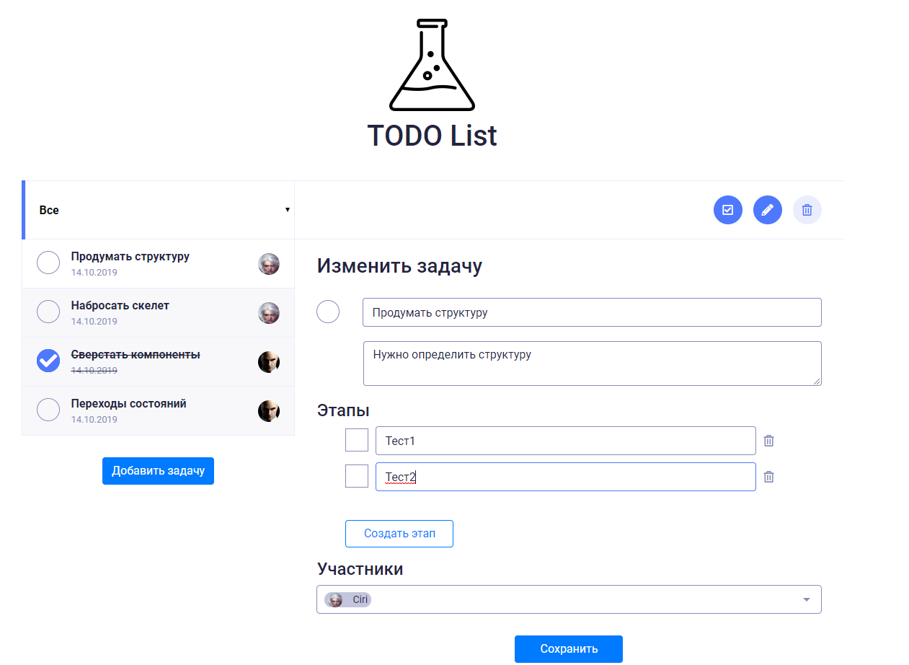

# Elma test
> Development of the SPA from the test [task](https://docs.google.com/document/d/1QWDUlIsFgbmIWNiM1cTCR_cNe4H6UZKkIbw6YLE7E30/edit#)




## Features

## Install
```
$ yarn install
$ yarn run dev
```

## Usage
Open [localhost:8080](http://localhost:8080)

## Demo
View demo [here](https://ichiro18.github.io/elma_test/)

## Built With
- [VueJS](https://vuejs.org/)
- [Webpack](https://webpack.js.org/)

## Versioning
For transparency into the release cycle and in striving to maintain backward compatibility, the current project is maintained under Semantic Versioning guidelines and will adhere to these rules whenever possible.

For more information on SemVer, please visit http://semver.org/.

## TODO
- [ ] VueJS SPA skeleton

## Authors
Authors
* **Ilya Zhuravlev** - *Developer* - [Илья Журавлев](https://vk.com/idev_dir)

## License
License [MIT License](http://http//opensource.org/licenses/mit-license.php)
